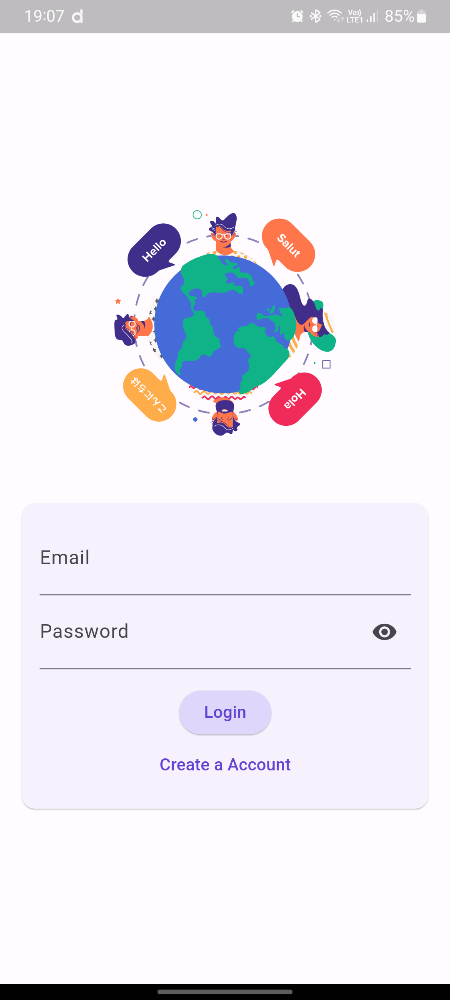
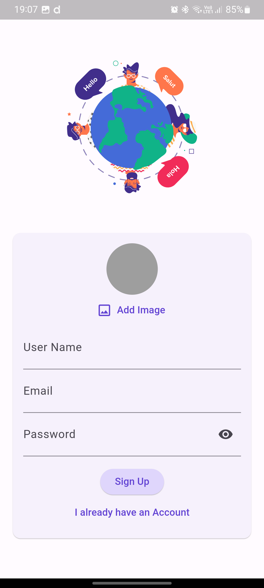

# chatify 💬

## Getting Started

    
    
    

### Prerequisites

Requirements for the app to run and other tools to build, test and push 
- Install Flutter

### Installing

Clone this repository 

    git clone https://github.com/adityawalture/Chatify.git

Dependecies Used

    firebase_core: ^2.24.1
    firebase_auth: ^4.15.1
    firebase_storage: ^11.5.5
    image_picker: ^1.0.4
    cloud_firestore: ^4.13.6
    firebase_messaging: ^14.7.9

## APK
<a href="https://drive.google.com/file/d/1XqGO74uwajbFQymqgfXHAaW7C2Xi1tEa/view?usp=sharing">Download APK</a>

## Contributing
Contributions are welcome! If you find a bug or have an idea for an enhancement, please open an issue or submit a pull request.