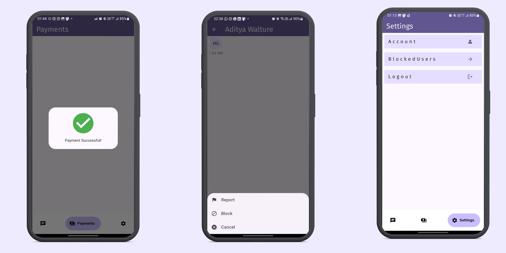

# च्याटify 📱💬

A flutter chating-app with stripe payment integration.

## Screenshots

    

    

    

# Description
A real-time chat application built using Flutter! This app not only lets you connect with friends and family but also allows seamless payments through Stripe.

# Features
Real-Time Messaging: Send messages instantly to your friends.
User Authentication: Securely sign in using Firebase authentication or your Google account.
Stripe Payments:ChatApp integrates with Stripe for hassle-free payments.

# How to use
    Clone this repository.
    Set up your Firebase project and configure the necessary credentials.
    Add your Stripe API keys.
    Run the app on your device or emulator.

Feel free to contribute, report issues, or suggest improvements. Let’s make ChatApp even better together! 🚀

# Dependecies and Api Used

    firebase_core
    firebase_auth
    firebase_storage
    cloud_firestore
    flutter_bloc
    google_sign_in
    google_nav_bar
    http
    flutter_stripe
    
    
Apk: <a href="https://github.com/adityawalture/Chatify/tree/main/apk">  च्याटify</a> 